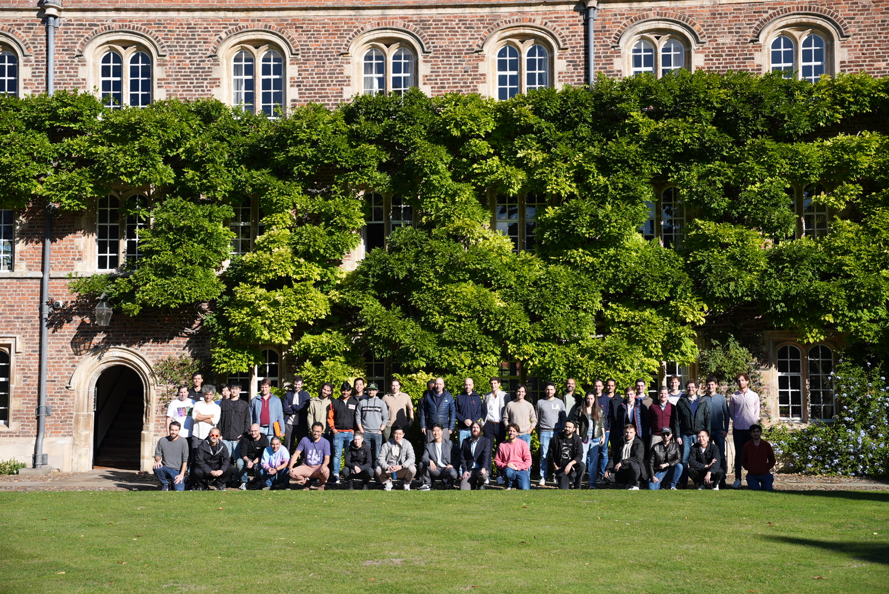

# lean week: leanVM + PQ workshops, Cambridge 2025

- **Date**: October 3-6, 2025  
- **Location**: Jesus College, Cambridge, UK  
- **Host**: Ethereum Foundation
- **YouTube Playlist**: [playlist](https://www.youtube.com/playlist?list=PLJqWcTqh_zKGPctGzVOBllZnCPQj-g7d3)

## lean week overview
This series captures the groundbreaking discussions and collaborations from the leanVM and Post-Quantum (PQ) Workshops held in Cambridge, UK, from October 3-6, 2025. Hosted by the Ethereum Foundation, these events brought together leading researchers, cryptographers, implementers, and developers to push the boundaries of Ethereum's lean consensus layer and post-quantum security.
- leanVM (Oct 3): Minimal zkVM design for PQ signature aggregation and recursive proving.
- PQ (Oct 4–6): Signature schemes, SNARK/FRI topics, devnet planning, performance and APIs.

This repository indexes talks from the leanVM and Post-Quantum (PQ) workshops held in Cambridge. Each session page includes a short summary plus links to the YouTube recording and slides (when available).

- Click an Item to open its summary page.
- On each page, follow links to the video and slides.
- Tags note the focus area: PQ-devnet (PQd), PQ-theory (PQt), PQ-implementation (PQi), leanVM (VM), formal verification (FV).

| Date  | Item              | Session                                      | Speaker(s)                          | PQd | PQt | PQi | VM | FV |
|-------|-------------------|----------------------------------------------|-------------------------------------|-----|-----|-----|----|----|
| Oct-3 | [leanVM-01](leanVM-01.md) | leanVM Crash Course & Sumcheck Optimization | [Thomas Coratger](https://x.com/tcoratger) & Emile          |     |     |  x  | x  |   |
| Oct-3 | [leanVM-02](leanVM-02.md) | Memory Models & Lookup Arguments            | [Thomas Coratger](https://x.com/tcoratger) & Emile          |     |     |  x | x  |   |
| Oct-3 | [leanVM-03](leanVM-03.md) | Compiler (workshop)                         | [Thomas Coratger](https://x.com/tcoratger) & Emile          |     |     |   x  | x  |   |
| Oct-4 | [pq1-01](pq1-01.md)    | PQ Ethereum Workshop - Day 1 Kickoff        | [Justin Drake](https://x.com/drakefjustin)                     | x   | x   | x   | x  | x  |
| Oct-4 | [pq1-02](pq1-02.md)    | Seven Years in Poseidon                     | [Antonio Sanso](https://x.com/asanso)                    |     | x   |     |    |    |
| Oct-4 | [pq1-03](pq1-03.md)    | Hash-based zkSNARKs                         | [Giacomo Fenzi](https://x.com/GiacomoFenzi)                    |     | x   |     |    |    |
| Oct-4 | [pq1-04](pq1-04.md)    | Introduction to LeanSig                     | Benedikt Wagner                  |     |  x  |    |    |    |
| Oct-4 | [pq1-05](pq1-05.md)    | Minimal zkVM for Lean Ethereum              | Emile                            |     |     |   x  | x  |   |
| Oct-4 | [pq1-06](pq1-06.md)    | XMSS Signature Aggregation                  | [Thomas Coratger](https://x.com/tcoratger)                  |     |     |   x  | x  |   |
| Oct-4 | [pq1-07](pq1-07.md)    | zk(E)VM Formal Verification                 | [Alexander Hicks](https://x.com/alexanderlhicks)                  |     |     |     |    | x  |
| Oct-4 | [pq1-08](pq1-08.md)    | ArkLib: Verified Proof Systems in Lean      | [Quang Dao](https://x.com/QuangVDao)                        |     |     |     |    | x  |
| Oct-4 | [pq1-09](pq1-09.md)    | PQ Devnet Updates                           | [Unnawut "O" Leepaisalsuwanna](https://x.com/unnawut)     | x   |    |     |    |    |
| Oct-4 | [pq1-10](pq1-10.md)    | PQ P2P Aggregation                          | Kamil Salakhiev                  | x   |    |     |    |    |
| Oct-4 | [pq1-11](pq1-11.md)    | Proximity Prize (workshop)                  | [Giacomo Fenzi](https://x.com/GiacomoFenzi) & [Benedikt Wagner](https://x.com/benedikt_wagner)  |     |  x   |    |    |    |
| Oct-4 | [pq1-12](pq1-12.md)    | WHIR Performance                            | [Thomas Coratger](https://x.com/tcoratger)                  |     |    | x   |  x  |    |
| Oct-4 | [pq1-13](pq1-13.md)    | WHIR Performance (workshop)                 | [Giacomo Fenzi](https://x.com/GiacomoFenzi)                    |     |    | x   |  x  |    |
| Oct-4 | [pq1-14](pq1-14.md)    | Devnet Specs (workshop)                     | [Unnawut "O" Leepaisalsuwanna](https://x.com/unnawut)     | x   |    |     |    |    |
| Oct-4 | [pq1-15](pq1-15.md)    | P2P Performance                             | [Raúl Kripalani](https://x.com/raulvk)                   | x   |     |     |    |    |
| Oct-4 | [pq1-16](pq1-16.md)    | PQ Ethereum Workshop - Day 1 Recap          | various                          | x   | x   | x   | x  | x  |
| Oct-5 | [pq2-01](pq2-01.md)    | PQ Ethereum Workshop - Day 2 Kickoff        | various                          | x   | x   | x   | x  | x  |
| Oct-5 | [pq2-02](pq2-02.md)    | The ethSTARK Toy Problem                    | [Albert Garreta](https://x.com/0xAlbertG)                   |     | x   |     |    |    |
| Oct-5 | [pq2-03](pq2-03.md)    | Bindings (workshop)                         | [Guillaume Ballet](https://x.com/gballet)                 |  x   |     |    |    |    |
| Oct-5 | [pq2-04](pq2-04.md)    | Minimal zkVM                                | Emile                            |     |     |  x   | x  |   |
| Oct-5 | [pq2-05](pq2-05.md)    | e2e Formal Verification                     | Julian Sutherland                |     |     |     |    | x  |
| Oct-5 | [pq2-06](pq2-06.md)    | Mutual Correlated Agreement                 | Eylon Yogev                      |     | x   |     |    |    |
| Oct-5 | [pq2-07](pq2-07.md)    | Mutual Correlated Agreement                 | Ulrich Haböck                     |     | x   |     |    |    |
| Oct-5 | [pq2-08](pq2-08.md)    | Walkthrough of ArkLib                       | [Quang Dao](https://x.com/QuangVDao)                        |     |     |     |    | x  |
| Oct-5 | [pq2-09](pq2-09.md)    | Generic VM Compilation Architectures        | Aki Kattis                       |     |     |    | x  |    |
| Oct-5 | [pq2-10](pq2-10.md)    | Devnet Breakout (p2p)                       | [Raúl Kripalani](https://x.com/raulvk)                   | x   |     |     |    |    |
| Oct-5 | [pq2-11](pq2-11.md)    | PQ Ethereum Workshop - Day 2 Recap          | various                          | x   | x   | x   | x  | x  |
| Oct-6 | [pq3-01](pq3-01.md)    | PQ Ethereum Workshop - Day 3 Kickoff        | various                          | x   | x   | x   | x  | x  |
| Oct-6 | [pq3-02](pq3-02.md)    | LeanSig KeyGen & API                        | Benedikt Wagner                  | x   |     | x   |   |    |
| Oct-6 | [pq3-03](pq3-03.md)    | Minimal zkVM - Cairo M Design               | Clément Walter                   |     |     |     | x  |   |
| Oct-6 | [pq3-04](pq3-04.md)    | Updates on Poseidon                         | Dmitry Khovratovich              |     | x   |     |    |    |
| Oct-6 | [pq3-05](pq3-05.md)    | Lean p2p                                    | [Thomas Thiery](https://x.com/soispoke)                    | x   |     |     |    |    |
| Oct-6 | [pq3-06](pq3-06.md)    | New ZK-Friendly Encoding for Aggregatable XMSS Signatures | Dmitry Khovratovich              |     |  x   |    |    |    |
| Oct-6 | [pq3-07](pq3-07.md)    | Proximity Prize (workshop)                  | various                          |     | x    |    |    |    |
| Oct-6 | [pq3-08](pq3-08.md)    | PQ Ethereum Workshop - Day 3 Recap          | various                          | x   | x   | x   | x  | x  |

## Daily Highlights

These summaries capture the essence of each day's activities, outcomes, and collaborative spirit. They provide a high-level overview of progress, insights, and next steps.

### October 3, 2025
The workshop launched with foundational explorations of minimal zkVM design for PQ signature aggregation, including essential op_code / instruction sets (ADD/MUL, DEREF, JUMP), memory constraints, and sumcheck optimizations like precomputation and SIMD packing. Afternoon dives into write-once memory models, advanced lookup arguments (LogUp, LogUp*), and bytecode compiler strategies yielded action items for generic sumcheck tools, CPU/GPU benchmarks, and proof/FFT optimizations. The day concluded with a debrief, scenic punting on the Cam, and networking dinner at Millworks.

### October 4, 2025
Kicking off with PQ overviews, hash-based cryptography, and the LeanSig/LeanVM stack, the day set a strong foundation for Ethereum's PQ future. Sessions advanced to Poseidon cryptanalysis, P2P aggregation in devnets, and the Proximity Prize. Afternoon highlights included WHIR performance tuning, devnet planning, and FFT insights during the debrief. Key outcomes: interop plans, P2P prototypes, prize refinements, and computational breakthroughs, highlighting interdisciplinary synergy.

### October 5, 2025
Day 2 opened with agenda-setting, followed by deep dives into toy problems, FRI/IOP soundness conjectures, Rust bindings challenges, and minimal zkVM architectures. Discussions on zkEVM trust bases, mutual correlated agreements, ArkLib verifications, memory arguments, and tree-based zkVM frameworks enriched the sessions. The recap emphasized devnet integration, verification strategies, and optimizations, yielding practical PQ solutions and theoretical leaps.

### October 6, 2025
The final day began with kickoffs, advancing to LeanSig APIs, Cairo M designs, Poseidon updates, Lean P2P optimizations, ZK-friendly XMSS encodings, and Proximity Prize experiments. Wrap-up reflections covered API refinements, design insights, funding talks, and implementation/validation plans. The workshop ended on a high note of collaborative achievements and forward momentum.

## Participants

This table lists attendees, their affiliations, and categories. Where available, X profiles are linked for direct connection and further insights.

| First          | Last              | Affiliation / Team       | Category                |
|----------------|-------------------|--------------------------|-------------------------|
| Will           | Corcoran          | EF - coordination        | coordination            |
| Ladislaus      | von Daniels       | EF - coordination        | coordination            |
| Justin         | Drake             | EF - architecture        | coordination            |
| Fara           | Woolf             | Ethproofs                | coordination            |
| Kamil          | Salakhiev         | Qlean (lean client)      | PQ devnet               |
| Unnawut "O"    | Leepaisalsuwanna  | Ream (lean client)       | PQ devnet               |
| Thomas         | Thiery            | EF - RIG                 | PQ devnet               |
| Raúl           | Kripalani         | EF - p2p                 | PQ devnet               |
| Guillaume      | Ballet            | Zeam (lean client)       | PQ devnet               |
| Mihir          | Faujdar           | Lantern (lean client)    | PQ devnet               |
| Bing           | Hwang Tan         | Zeam (lean client)       | PQ devnet               |
| Jun            | Song              | Ream (lean client)       | PQ devnet               |
| Simon          | Jentzch           | Corpus (lean light client) | PQ devnet             |
| Satush "Sato"  | Das               | Prysm (beacon client)    | PQ devnet               |
| Antonio        | Sanso             | EF - cryptography        | PQ theory               |
| Dmitry         | Khovratovich      | EF - cryptography        | PQ theory               |
| Benedikt       | Wagner            | EF - cryptography        | PQ theory               |
| Giacomo        | Fenzi             | EPFL                     | PQ theory               |
| Ulrich         | Haböck            | StarkWare                | PQ theory               |
| Albert         | Garreta           | Nethermind               | PQ theory               |
| Aki            | Kattis            | independent              | PQ theory               |
| Clément        | Walter            | Kakarot                  | PQ theory               |
| Eylon          | Yogev             | Bar-Ilan University      | PQ theory               |
| Nico           | Mohnblatt         | zkSecurity               | PQ theory               |
| Benjamin       | Diamond           | Irreducible              | PQ theory               |
| Jim            | Posen             | Irreducible              | PQ theory               |
| Mikhail        | Kudinov           | Blockstream              | PQ theory               |
| Thomas         | Coratger          | EF - zkEVM               | PQ implementation       |
| Emile          | -                 | EF grantee               | PQ implementation       |
| Robin          | Salen             | Polygon                  | PQ implementation       |
| Angus          | Gruen             | Polygon                  | PQ implementation       |
| Diego          | Kingston          | LambdaClass              | PQ implementation       |
| Mauro          | Toscano           | LambdaClass              | PQ implementation       |
| Manuel         | Puebla            | LambdaClass              | PQ implementation       |
| Mamy           | Ratsimbazafy      | Lita                     | PQ implementation       |
| Sebastian      | Schmidt           | Lita                     | PQ implementation       |
| Morgan         | Thomas            | Lita                     | PQ implementation       |
| Carlo          | Modica            | Lita                     | PQ implementation       |
| Shouki         | Tsuda             | Nyx Foundation           | PQ implementation       |
| Wei Jie        | Koh               | independent              | PQ implementation       |
| Quang          | Dao               | CMU                      | PQ formal verification  |
| Alex           | Hicks             | EF - snarkification      | PQ formal verification  |
| Julian         | Sutherland        | Nethermind               | PQ formal verification  |
| Banri          | Yanahama          | Nyx Foundation           | PQ formal verification  |
| Katy           | Hristova          | Nethermind               | PQ formal verification  |
| Ilia           | Vlasov            | Nethermind               | PQ formal verification  |

## Key Terms by Topic

Dive into essential concepts discussed during the workshops. These terms are grouped thematically for easy reference, with brief explanations to demystify the technical jargon.

### zkVM Design
- **Minimal zkVM**: A custom DSL optimized for PQ aggregation, emphasizing core operations to reduce overhead.
- **Memory Model**: Write-once cells with assertions; frame-relative addressing (FP) for efficient access.
- **Dereference Instruction**: Facilitates cross-frame data access for arguments and results.
- **Jump Instruction**: Manages calls, returns, and control flow with target_fp_hint for streamlined execution.

### Protocols and Optimizations
- **Sumcheck Protocol**: Enhanced via precomputation, univariate skip, and SIMD packing for faster proofs.
- **PIOP/PCS**: Tunable for base/extension-field efficiency, incorporating Bagad-style and Cauchy gadgets.
- **FFT Layout**: Butterfly reordering optimizes cache and SIMD compatibility.
- **Fiat–Shamir**: Structures proof objects for serialization and cross-system interoperability.

### Compiler and Deployment
- **Compiler**: Balances DSLs and circuit-builder APIs; supports offline precomputation for efficiency.
- **Targets**: CPU-focused (e.g., Raspberry Pi) for validators; GPU-assisted for high-throughput aggregation.
- **Folding/Accumulation**: Nova-like techniques minimize proof sizes.

### zkVM and Signatures
- **LeanSig**: Hash-based PQ scheme with SNARK aggregation for secure, efficient signing.
- **LeanVM**: Minimal zkVM dedicated to recursive XMSS signature aggregation.
- **XMSS**: Stateful hash-based signatures integrated with Merkle trees for verification.

### Protocols and Optimizations
- **Sumcheck Protocol**: Base/extension-field strategies optimize proof generation.
- **WHIR**: Hash-based system with batching and SIMD for high performance.
- **Fiat–Shamir**: Converts interactive proofs to non-interactive, enhancing usability.
- **Proximity Prize**: $1M incentive for breakthroughs in coding theory conjectures.

### Networking and Deployment
- **P2P Stack**: Evolves from libp2p to minb2p/eB2P for specialized PQ aggregation.
- **Devnet**: Phased testing for PQ signatures and network integration.
- **FFT Optimization**: Ring-switching and cache-oblivious methods boost efficiency.

### zkVM and Verification
- **Minimal zkVM**: DSL with read-only memory and simple ISA for aggregation.
- **ArkLib**: Lean library for verified SNARK specifications and proofs.
- **Trust Base**: Formal EVM/RISC-V semantics; verified compilers ensure reliability.

### Protocols and Optimizations
- **Toy Problem**: Simulates STARK/FRI soundness; identifies conjecture vulnerabilities.
- **Correlated Agreement**: Ensures codeword consistency; mCA enhances alignment.
- **Memory Arguments**: Tree-based with local transitions for efficient proofs.

### Integration and Implementation
- **Rust Bindings**: Addresses compilation, symbol, and version challenges.
- **One Proving**: ZK-proving for Ethereum execution via constraint systems.

### Signatures and APIs
- **LeanSig**: XMSS-based with Merkle trees for PQ security.
- **KeyGen/Sign/Verify**: APIs with auxiliary data for optimized operations.

### zkVM Designs
- **Cairo M**: Small-field zkVM with continuations and messaging.
- **IO Gadgets**: Enables inter-table consistency checks.

### Cryptanalysis and Networking
- **Poseidon Initiative**: Offers bounties and grants for algebraic attack research.
- **Lean P2P**: RTT-aware forwarding via SOON rule for low-latency.

### Encodings and Prize
- **ZK-Friendly Encoding**: Simplex sampling with rejection ensures uniformity.
- **Proximity Prize**: Drives numerical/combinatorial experiments on conjectures.

---

*Note: This overview provides links to detailed session summaries, including key discussions, decisions, and action items. Summaries were generated in part with the help of AI, so names and terms may not be 100% accurate.*